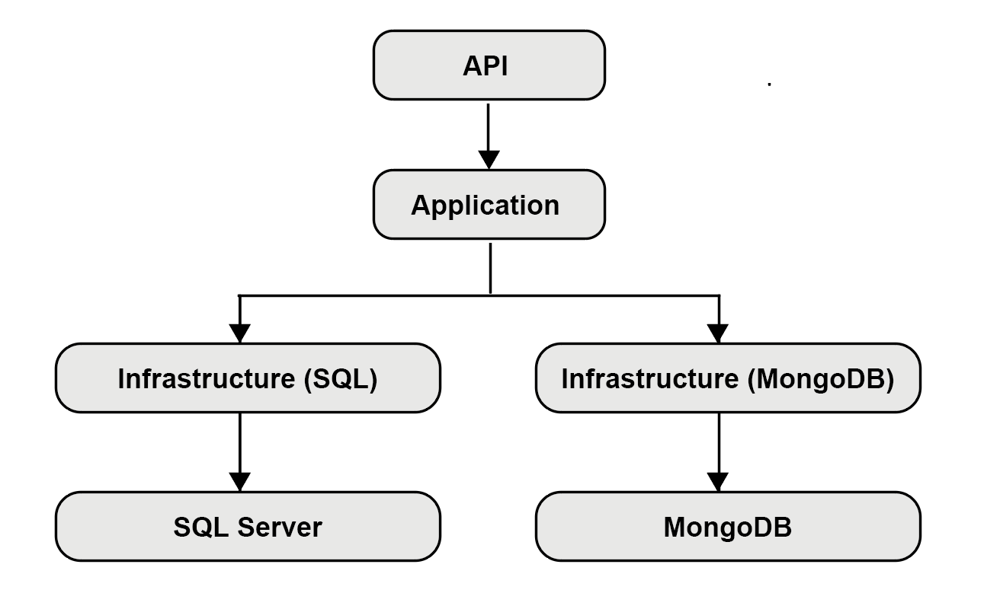

# Online Store Orders – Clean Architecture | DDD | CQRS | SQL Server + MongoDB | React

Neste projeto criei uma API RESTful para gerenciamento de pedidos, produtos e clientes de uma loja online, seguindo os seguintes padrões e critérios:

- **.NET Core 5 +**
- **DDD**
- **CQRS**
- **Clean Architecture / Clean code**
- **SQL Server + MongoDB**
- **MediatR, EF Core, Dapper**
- **Swagger / OpenAP**
- **Conectado a um Front-End React**

---

# Sobre a Arquitetura

Organizei o sistema seguindo essa padronização:

- **API:** Controllers, Endpoints REST, Injeção de Dependências 
- **Application:** Commands, Queries, Handlers (usando o MediatR), lógica de casos de uso 
- **Infrastructure:** Persistência (SQL Server), MongoDB Read Model, Repositórios 
- **Domain:** Entidades, enums, interfaces, regras essenciais do domínio 

Também separei a parte de leitura e escrita sendo: 

- Escrita (**Write Model**): armazenada no SQL Server usando o Entity Framework 
- Leitura (**Read Model**): armazenada no MongoDB para consultas rápidas

---

# Diagrama da Arquitetura

Simplificação visual do fluxo do sistema (Clean Arquiteture / CQRS)



---

# Endpoints da API

## Products
**Rota base:** /api/products

```
GET	    /api/products	    
GET	    /api/products/{id}	
POST	/api/products	    
PUT	    /api/products/{id}	
DELETE	/api/products/{id}	
```


## Orders
**Rota base:** /api/orders

```
GET	    /api/orders	        (lidos do MongoDB)
GET	    /api/orders/{id}	(lidos do MongoDB)
POST	/api/orders	        (cria no SQL Server e gera o read model no MongoDB)
PUT	    /api/orders/{id}	(SQL Server + MongoDB)
DELETE	/api/orders/{id}	(SQL Server + remove read model do MongoDB)
```

